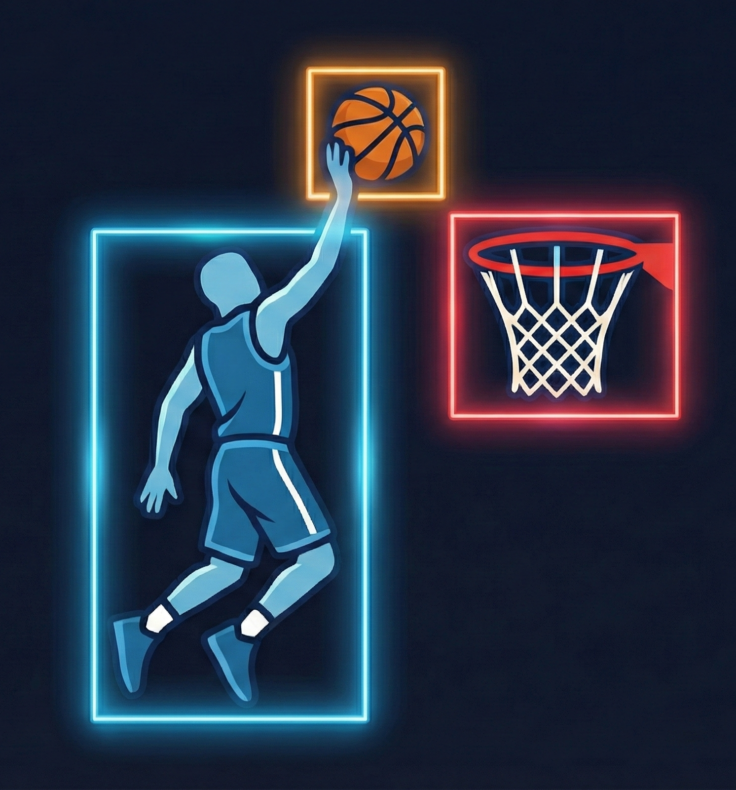
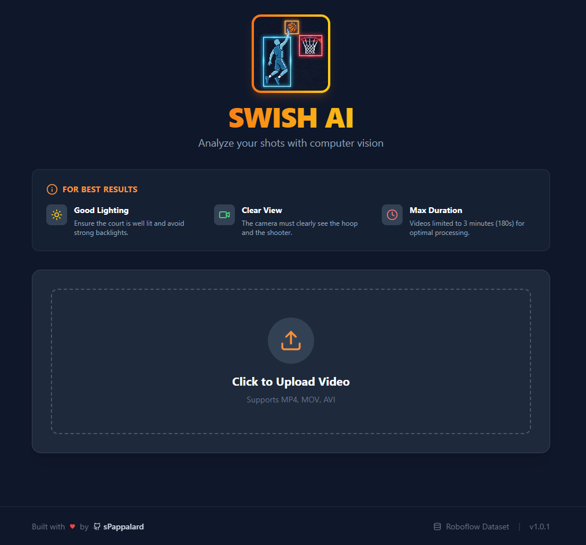
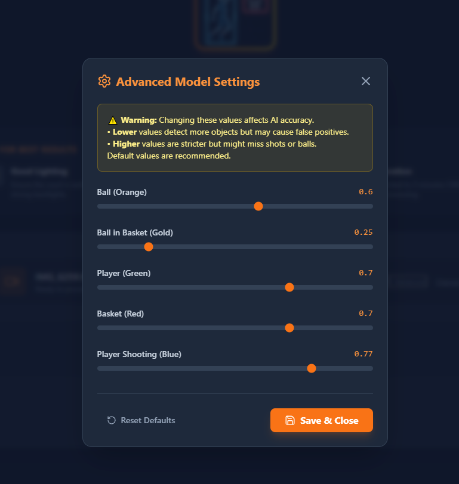
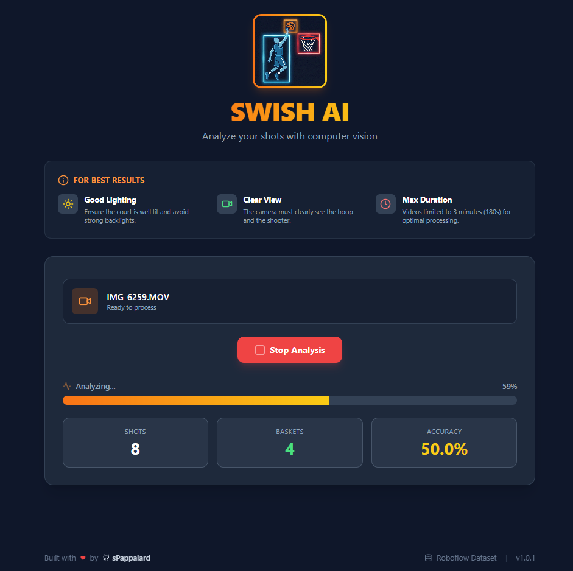

# 🏀 SwishAI - Basketball Shot Analysis & Tracking

<div align="center">
  
  
  **A Computer Vision application for automated basketball shot analysis using YOLOv11**
  
  [](LICENSE.txt)
  [](https://www.python.org/)
  [](https://react.dev/)
  [](https://fastapi.tiangolo.com/)
</div>

---


## 📋 Table of Contents

- [Overview](#-overview)
- [Key Features](#-key-features)
- [Screenshots](#-screenshots)
- [Quick Start](#-quick-start)
- [Tech Stack](#-tech-stack)
- [Project Structure](#-project-structure)
- [Installation](#️-installation)
- [Usage Guide](#-usage-guide)
- [Technical Details](#-technical-details)
- [Model Performance](#-model-performance)
- [Configuration](#-configuration)
- [Troubleshooting](#-troubleshooting)
- [Credits](#-credits)
- [License](#-license)

---

## 🎯 Overview

SwishAI is an intelligent computer vision system that automatically analyzes basketball games from video footage. It detects players, basketballs, hoops, and shooting poses in real-time, tracking shot attempts and successful baskets to calculate field goal percentages. The system provides customizable processing modes with visual effects and generates detailed per-player statistics.

**Key Highlights:**
- Real-time object detection using YOLOv11s
- Automatic shot tracking and basket counting
- Per-player statistics generation
- Three processing modes (Full Tracking, Stats & Effects, Stats Only)
- Confidence threshold adjustment for different lighting conditions
- Court homography for accurate positional mapping

---

## ✨ Key Features

### Object Detection
- **5 Detection Classes**: Ball, Ball in Basket, Player, Basket, Player Shooting
- **Real-time Performance**: Optimized for consumer-grade GPUs
- **Custom Augmentation**: Specialized for sports footage and motion tracking

### Smart Scoring System
- **Automatic Shot Detection**: Identifies shooting poses and shot attempts
- **Basket Counting**: Tracks successful shots with cooldown logic to prevent double-counting
- **Field Goal Percentage**: Real-time calculation of shooting accuracy
- **Per-Player Statistics**: Breakdown by player ID with shot positions

### Visual Features
- **Dynamic Overlays**: Real-time bounding boxes and tracking annotations
- **Pulse Effects**: Visual feedback when baskets are scored
- **Court Minimap**: Bird's-eye view projection using court homography
- **Customizable HUD**: Toggle between different visualization levels

### Processing Modes
1. **Full Tracking**: Bounding boxes + Visual Effects + Complete HUD
2. **Stats & Effects**: Clean visualization with scoring effects only
3. **Stats Only**: Minimal overlay with essential statistics

### Optimization & Utilities
- **Test Mode**: Process only first 15 seconds for quick validation
- **Auto-Cleanup**: Automatic deletion of old files to manage storage
- **Batch Processing**: Built-in handling for multiple videos
- **CSV Export**: Per-player statistics bundled with output

---

## 📸 Screenshots

<div align="center">
  
  <p><em>Upload interface with processing mode selection</em></p>
</div>

<div align="center">
  
  <p><em>Confidence threshold configuration for each detection class</em></p>
</div>

<div align="center">
  
  <p><em>Real-time progress tracking with live statistics</em></p>
</div>

---

## 🚀 Quick Start

### Prerequisites
- Python 3.10+
- Node.js 18+ & npm
- NVIDIA GPU (recommended; CPU mode available but slow)
- 4GB+ RAM

### 30-Second Setup

```bash
# Clone and navigate
cd Basketball_AI

# Backend setup
cd BE
python -m venv venv
# Windows: .\venv\Scripts\activate
# Mac/Linux: source venv/bin/activate
pip install -r requirements.txt

# Frontend setup (new terminal)
cd FE
npm install
npm run dev

# Start backend (in first terminal, from BE/)
python app.py
```

Visit `http://localhost:5173` to access the app.

---

## 🛠 Tech Stack

### Backend
| Component | Technology | Version |
|-----------|-----------|---------|
| **Framework** | FastAPI | 0.115.0 |
| **Server** | Uvicorn | 0.32.0 |
| **Deep Learning** | PyTorch | 2.5.1 |
| **Object Detection** | Ultralytics YOLO | 8.3.223 |
| **Computer Vision** | OpenCV | 4.10.0.84 |
| **Data Processing** | NumPy, Pandas | Latest |

### Frontend
| Component | Technology | Version |
|-----------|-----------|---------|
| **Framework** | React | 19.1.1 |
| **Build Tool** | Vite | 7.1.7 |
| **Styling** | Tailwind CSS | 3.4.1 |
| **Icons** | Lucide React | 0.552.0 |

### Development & Deployment
- **GPU**: NVIDIA CUDA (recommended)
- **Python Environment**: venv/conda
- **Package Management**: pip, npm

---

## 📂 Project Structure

```
Basketball_AI/
│
├── BE/                                 # Backend (Python)
│   ├── app.py                         # FastAPI server & main application logic
│   ├── train_model.py                 # YOLO11 training script
│   ├── calibrate.py                   # Court homography calibration tool
│   ├── metrics.py                     # Model performance analysis
│   ├── requirements.txt               # Python dependencies
│   │
│   ├── basketball_training/           # Training artifacts
│   │   ├── yolo26m_5classes/         # Trained model (mAP50: 0.909)
│   │   │   ├── weights/
│   │   │   │   ├── best.pt           # Best model weights
│   │   │   │   └── last.pt           # Latest checkpoint
│   │   │   └── results.csv           # Training metrics
│   │   └── yolo26s_5classes/         # Alternative model
│   │       └── weights/
│   │
│   ├── tracker/                       # Multi-object tracking config
│   │   ├── botsort.yaml              # BoTSORT tracker config
│   │   ├── bytetrack.yaml            # ByteTrack tracker config
│   │   ├── homography.npy            # Court transformation matrix
│   │   └── minimap.png               # Court reference image
│   │
│   ├── basketball-detection-srfkd-1/  # Dataset (Roboflow)
│   │   ├── data.yaml                 # Dataset configuration
│   │   ├── train/                    # Training images & labels
│   │   ├── valid/                    # Validation images & labels
│   │   └── test/                     # Test images & labels
│   │
│   ├── uploads/                       # User-uploaded videos (auto-cleaned)
│   ├── processed/                     # Output videos & stats (auto-cleaned)
│   ├── metrics_reports/               # Performance analysis outputs
│   └── runs/                          # YOLO validation results
│
├── FE/                                 # Frontend (React)
│   ├── src/
│   │   ├── App.jsx                   # Main React component
│   │   ├── App.css                   # Component styles
│   │   ├── index.css                 # Global styles
│   │   ├── main.jsx                  # Entry point
│   │   └── assets/                   # Static resources
│   │
│   ├── public/                        # Static files
│   │   ├── logo.png
│   │   ├── 1.png - 7.png             # Screenshots
│   │   └── *.png                     # Training metrics images
│   │
│   ├── package.json                   # Node dependencies
│   ├── vite.config.js                 # Vite configuration
│   ├── tailwind.config.js             # Tailwind CSS config
│   ├── postcss.config.js              # PostCSS config
│   └── index.html                     # HTML template
│
├── README.md                           # This file
├── LICENSE.txt                         # AGPL-3.0 License
└── install_env.bat                     # Windows setup script
```

---

## ⚙️ Installation

### 1. Backend Setup

#### Option A: Manual Setup

```bash
cd BE

# Create virtual environment
python -m venv venv

# Activate (choose your OS)
# Windows:
.\venv\Scripts\activate
# Mac/Linux:
source venv/bin/activate

# Install dependencies
pip install -r requirements.txt

# Verify CUDA (GPU support) - optional but recommended
python -c "import torch; print(f'CUDA: {torch.cuda.is_available()}')"
```

#### Option B: Automated Setup (Windows)

```bash
cd ~
.\install_env.bat
```

### 2. Frontend Setup

```bash
cd FE

# Install dependencies
npm install

# Verify installation
npm run lint
```

### 3. Dataset & Model Setup

#### Using Pre-trained Weights

The project includes pre-trained models in `BE/basketball_training/`:

```bash
# Default model (YOLOv11s, optimized for speed)
# Located at: BE/basketball_training/yolo26s_5classes/weights/best.pt

# Alternative model (YOLOv11m, higher accuracy)
# Located at: BE/basketball_training/yolo26m_5classes/weights/best.pt
```

#### Training from Scratch

1. **Download Dataset**
   ```bash
   # Get the Basketball Detection Dataset from Roboflow Universe
   # https://universe.roboflow.com/basketball-6vyfz/basketball-detection-srfkd
   # Extract to: BE/basketball-detection-srfkd-1/
   ```

2. **Configure Training** (BE/train_model.py)
   ```python
   class Config:
       EPOCHS = 200          # Adjust based on your hardware
       BATCH_SIZE = 8        # For 6GB VRAM; increase for better hardware
       IMG_SIZE = 640
       DEVICE = 0            # GPU index (0 = first GPU)
       WORKERS = 0           # Keep 0 on Windows
   ```

3. **Run Training**
   ```bash
   cd BE
   python train_model.py
   ```

#### Court Calibration

Generate homography matrix for your specific court:

```bash
cd BE
python calibrate.py --video <path_to_video>
```

This creates:
- `tracker/homography.npy` - Transformation matrix
- `tracker/minimap.png` - Court reference image

---

## 🎮 Usage Guide

### Starting the Application

**Terminal 1 - Backend:**
```bash
cd BE
source venv/bin/activate  # or .\venv\Scripts\activate on Windows
python app.py
```
Server runs at `http://localhost:8000`

**Terminal 2 - Frontend:**
```bash
cd FE
npm run dev
```
App runs at `http://localhost:5173`

### Processing a Video

1. **Open the App**
   - Navigate to `http://localhost:5173`

2. **Upload Video**
   - Click upload area or drag-and-drop
   - Supports: MP4, MOV, AVI (max 3 minutes, max 1920×1080)

3. **Configure Settings**
   - **Processing Mode**: Choose visualization level
   - **Advanced Settings** (optional):
     - Adjust confidence thresholds for each class
     - Lower thresholds for dim lighting, raise for bright conditions
   - **Test Mode**: Check to process only first 15 seconds

4. **Start Analysis**
   - Click "Start Analysis"
   - Real-time progress bar shows processing status
   - Live statistics update as analysis progresses

5. **Download Results**
   - ZIP file contains:
     - `output_video.mp4` - Annotated video with overlays
     - `player_stats.csv` - Per-player statistics

### Output Files

**CSV Format:**
```csv
player_id, shots, baskets, accuracy_pct, shot_positions_json
1, 15, 9, 60.0, "[{x: 100, y: 200}, ...]"
2, 12, 8, 66.7, "[{x: 150, y: 250}, ...]"
```

---

## 🧠 Technical Details

### Detection Classes

| ID | Class | Function | Default Confidence |
|----|-------|----------|-------------------|
| 0 | Ball | Track basketball | 0.60 |
| 1 | Ball in Basket | Detect successful shot | 0.25 |
| 2 | Player | Identify all players | 0.70 |
| 3 | Basket | Localize hoop | 0.70 |
| 4 | Player Shooting | Identify shooter | 0.70 |

### Physics & Cooldown Logic

**Problem**: Single shooting motion detected in 10+ consecutive frames

**Solution**: Temporal cooldown windows

```python
SHOT_COOLDOWN = 1.0     # seconds - wait after detecting a shot
BASKET_COOLDOWN = 1.0   # seconds - wait after basket scoring
ANIMATION_DURATION = 1  # seconds - pulse effect duration
```

**How it works:**
1. "Player Shooting" detected → start shot cooldown timer
2. During cooldown, ignore new shot detections
3. "Ball in Basket" detection → basket only counts if outside basket cooldown
4. Prevent duplicate counting across frame boundaries

### Custom Augmentation Strategy

Training augmentation optimized for sports footage:

```python
AUGMENTATION = {
    # Color & Lighting
    'hsv_h': 0.015,      # Hue variation (color shifts)
    'hsv_s': 0.4,        # Saturation (orange ball in any light)
    'hsv_v': 0.2,        # Value/brightness (shadows, flares)
    
    # Geometry & Position
    'degrees': 10,       # Rotation (camera angles)
    'translate': 0.1,    # Translation (object movement)
    'scale': 0.5,        # Scaling (depth variation)
    'shear': 2.0,        # Shearing (perspective)
    
    # Advanced
    'flipud': 0.5,       # Vertical flip
    'fliplr': 0.5,       # Horizontal flip
    'mosaic': 1.0,       # Mosaic augmentation
    'mixup': 0.15        # Mixup (blend images)
}
```

**Why**: Sports videos have high motion, varied lighting, and crowded scenes.

### Court Projection

The minimap uses homography transformation to:
1. Map 3D court coordinates to 2D video frame
2. Project detected players onto bird's-eye court view
3. Show real-time player positions and shot locations

**Calibration Requirements:**
- 4+ court corner points from reference image
- Corresponding image coordinates
- Generated transformation matrix (`homography.npy`)

---

## 📊 Model Performance

### Training Configuration

**Hardware Used:**
- GPU: NVIDIA GTX 1060 6GB
- CPU: Intel i7-6700K
- RAM: 16GB DDR4
- Training Time: ~48 hours

**Model Specifications:**
- **Architecture**: YOLOv11s (small variant)
- **Input Size**: 640×640 pixels
- **Epochs**: 200
- **Batch Size**: 8
- **Optimizer**: AdamW with cosine decay
- **Learning Rate**: 0.01 → 0.0005

### Performance Metrics

**Overall Accuracy** (Epoch 200):
- **mAP50**: 0.909 (Mean Average Precision at IoU ≥ 0.5)
- **mAP50-95**: 0.623 (Average across IoU thresholds)
- **Precision**: 0.878
- **Recall**: 0.861

**Per-Class Performance:**

| Class | Precision | Recall | mAP50 | Strength |
|-------|-----------|--------|-------|----------|
| Ball | 0.80 | 0.88 | 0.847 | Robust detection |
| Ball in Basket | 0.51 | 0.36 | 0.932 | Rare but distinctive |
| Player | 0.86 | 0.85 | 0.928 | Excellent tracking |
| Basket | 0.91 | 0.91 | 0.966 | Very reliable |
| Player Shooting | 0.76 | 0.34 | 0.873 | Rare pose |

### Training Curves

Training metrics visualizations available in `FE/public/`:
- `results.png` - Loss curves (box, class, total)
- `confusionMatrix.png` - Classification accuracy
- `normalizedMatrix.png` - Normalized confusion matrix
- `PR_curve.png` - Precision-recall tradeoff
- `P_curve.png` - Precision vs confidence threshold
- `R_curve.png` - Recall vs confidence threshold
- `F1_curve.png` - F1-score optimization curve

### Improving Model Performance

For better accuracy with better hardware:

```python
# In train_model.py Config class:
EPOCHS = 300              # Longer training
BATCH_SIZE = 16           # Larger batches (RTX 3080+)
BASE_MODEL = "yolo11m.pt" # Larger model (medium)
# or
BASE_MODEL = "yolo11l.pt" # Large model (24GB+ VRAM)
```

**Advanced Techniques:**
- Extended training (300+ epochs)
- Larger model variants (YOLOv11m, YOLOv11l)
- Additional data augmentation
- Fine-tuning on specific courts
- Ensemble methods

---

## ⚙️ Configuration

### Backend Configuration (BE/app.py)

```python
class Config:
    # Video constraints
    MAX_DURATION_SECONDS = 180   # 3 minutes max
    TEST_MODE_DURATION = 15      # Test mode length
    
    # File retention (auto-cleanup)
    RETENTION_SECONDS = 600      # 10 minutes
    CLEANUP_INTERVAL = 60        # Check every 60s
    
    # Physics (in seconds)
    SHOT_COOLDOWN = 1.0          # Shot detection debounce
    BASKET_COOLDOWN = 1.0        # Basket detection debounce
    ANIMATION_DURATION = 1       # Pulse effect length
    
    # Detection thresholds (0.0-1.0)
    THRESHOLDS = {
        0: 0.60,   # Ball
        1: 0.25,   # Ball in Basket
        2: 0.70,   # Player
        3: 0.70,   # Basket
        4: 0.70    # Player Shooting
    }
    
    # Court dimensions (cm)
    COURT_WIDTH_CM = 1500        # FIBA half-court width
    COURT_HEIGHT_CM = 1400       # FIBA half-court depth
```

### Adjusting for Different Scenarios

**Dim Lighting:**
```python
THRESHOLDS = {
    0: 0.50,   # Lower ball threshold
    1: 0.20,   # Lower basket threshold
    2: 0.65,   # Slightly lower player
    3: 0.65,
    4: 0.65
}
```

**Crowded Indoor Court:**
```python
SHOT_COOLDOWN = 0.8      # Faster shot detection
BASKET_COOLDOWN = 1.2    # Slower basket debounce
THRESHOLDS = {
    2: 0.75,   # Higher player threshold
    4: 0.75    # Stricter shooting pose
}
```

---

## 🔧 Troubleshooting

### Backend Issues

**"CUDA not available"**
```bash
# Check GPU drivers
nvidia-smi

# Install CUDA-compatible PyTorch
pip install torch torchvision --index-url https://download.pytorch.org/whl/cu118
```

**"Port 8000 already in use"**
```bash
# Linux/Mac: Kill process on port 8000
lsof -i :8000 | grep LISTEN | awk '{print $2}' | xargs kill -9

# Windows: Use alternative port
python app.py --port 8001
```

**"Model file not found"**
- Verify `BE/basketball_training/yolo26s_5classes/weights/best.pt` exists
- Download from original SwishAI repository if missing

### Frontend Issues

**"Cannot connect to backend"**
- Verify backend running: `http://localhost:8000/docs`
- Check CORS settings in `BE/app.py`
- Verify port 8000 is accessible

**"npm install fails"**
```bash
# Clear cache and retry
npm cache clean --force
rm -rf node_modules package-lock.json
npm install
```

### Video Processing Issues

**"Video too large/too long"**
- Max duration: 3 minutes (180 seconds)
- Max resolution: 1920×1080
- Pre-process with: `ffmpeg -i input.mp4 -t 180 -s 1280x720 output.mp4`

**"Low confidence detections"**
- Check lighting conditions
- Try Test Mode first (15 seconds)
- Adjust thresholds in Advanced Settings
- Verify video quality is acceptable

**"Out of memory during processing"**
```python
# In BE/app.py, reduce batch processing
# Or process shorter video segments
```

---

## 📈 Project Statistics

- **Lines of Code**: ~3000+ (Backend), ~1500+ (Frontend)
- **Training Data**: ~10,000 annotated images
- **Detection Classes**: 5
- **Supported Video Formats**: MP4, MOV, AVI
- **Processing Speed**: ~5-30 FPS (depends on GPU and resolution)

---

## 🎓 Learning Resources

### YOLO & Computer Vision
- [Ultralytics YOLOv11 Docs](https://docs.ultralytics.com/)
- [Object Detection Fundamentals](https://github.com/ultralytics/yolov5/wiki)

### FastAPI & Web Development
- [FastAPI Documentation](https://fastapi.tiangolo.com/)
- [React Documentation](https://react.dev/)

### Sports Analytics
- [Basketball Court Dimensions](https://en.wikipedia.org/wiki/Basketball_court)
- [Video Analysis with OpenCV](https://docs.opencv.org/)

---

## 🤝 Contributing

We welcome contributions! Areas for improvement:

1. **Model Improvements**
   - More diverse training data
   - Fine-tuning for specific courts
   - Ensemble methods

2. **Features**
   - Multi-camera support
   - Advanced player statistics
   - Live streaming analysis
   - Mobile app

3. **Performance**
   - GPU optimization
   - Model quantization
   - Distributed processing

4. **Documentation**
   - Video tutorials
   - API documentation
   - Deployment guides

---

## 📜 Credits

**Original Repository**: [SwishAI](https://github.com/sPappalard/SwishAI) by sPappalard

**Modified & Enhanced by**: DiegoGMD

**Key Technologies**:
- [Ultralytics YOLO](https://github.com/ultralytics/ultralytics)
- [FastAPI](https://github.com/tiangolo/fastapi)
- [React](https://github.com/facebook/react)
- [OpenCV](https://github.com/opencv/opencv)

**Dataset**: [Basketball Detection Dataset - Roboflow Universe](https://universe.roboflow.com/basketball-6vyfz/basketball-detection-srfkd)
- Created by: basketball community
- License: CC BY 4.0
- ~10,000 annotated images
- 5 detection classes

### Citation

If you use SwishAI in your research, please cite:

```bibtex
@software{swishai2025,
  author = {sPappalard and DiegoGMD},
  title = {SwishAI: Basketball Shot Analysis & Tracking},
  url = {https://github.com/sPappalard/SwishAI},
  year = {2025}
}

@misc{basketball_dataset,
  title = {Basketball Detection Dataset},
  author = {Roboflow},
  url = {https://universe.roboflow.com/basketball-6vyfz/basketball-detection-srfkd},
  year = {2025},
  license = {CC BY 4.0}
}
```

---

## 📄 License

This project is released under the **GNU Affero General Public License v3.0 (AGPL-3.0)**.

### Why AGPL-3.0?

SwishAI integrates **Ultralytics YOLO**, which is licensed under AGPL-3.0. As a derivative work, this project inherits this license to ensure full compliance.

### What This Means

- ✅ **Use**: Personal, research, or commercial purposes
- ✅ **Modify**: Change the source code
- ✅ **Distribute**: Share with others
- 🔄 **Condition**: If you distribute or run as a network service (SaaS), you **must** disclose and share your source code modifications under AGPL-3.0

See [LICENSE.txt](LICENSE.txt) for full terms.

---

## 📞 Support & Feedback

- **Issues**: Open an issue on GitHub
- **Discussions**: Check existing discussions or create new ones
- **Documentation**: See individual module docstrings in source code

---

## 🔮 Roadmap

- [ ] Multi-camera support
- [ ] Player identification (face/jersey recognition)
- [ ] Advanced stats (shooting range, shot types)
- [ ] Live streaming analysis
- [ ] Mobile application
- [ ] Cloud deployment guide
- [ ] REST API enhancements
- [ ] Real-time 3D court visualization

---

<div align="center">

**Made with 🏀 and 💙 by basketball enthusiasts**

⭐ If this project helps you, please consider giving it a star!

</div>
